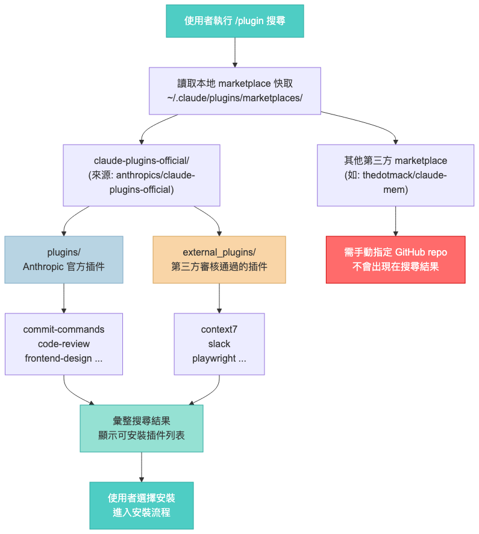
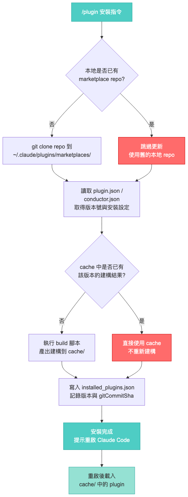

# Claude Code Plugin 機制解析

<a id="目錄"></a>

## 📑 目錄

- [概述](#概述)
- [階段一：Plugin Discovery（插件發現）](#階段一plugin-discovery插件發現)
- [階段二：Plugin Install（插件安裝）](#階段二plugin-install插件安裝)
- [已知 Bug：快取未更新問題](#已知-bug快取未更新問題)
- [Workaround：手動更新步驟](#workaround手動更新步驟)

---

## 概述

Claude Code 的 plugin 載入採用**兩階段機制**：

| 階段 | 名稱 | 說明 |
|------|------|------|
| 1 | **Discovery** | 從 marketplace 發現可用插件 |
| 2 | **Install** | 從本地 marketplace repo 讀取設定、build、放入 cache |

兩個階段都有各自的快取，且目前存在**快取未自動更新**的已知 bug。

[⬆ 回到目錄](#目錄)

---

## 階段一：Plugin Discovery（插件發現）

使用者執行 `/plugin` 搜尋時，Claude Code 從本地的 marketplace 快取讀取可用插件列表。



### Marketplace 來源

插件來源分為三類：

| 類型 | 路徑 | 說明 |
|------|------|------|
| 官方插件 | `plugins/` | Anthropic 官方開發維護 |
| 第三方審核插件 | `external_plugins/` | 社群提交、通過審核後收錄 |
| 未收錄插件 | 獨立 GitHub repo | 需手動指定 repo 安裝，不出現在搜尋結果 |

### 本地快取結構

```
~/.claude/plugins/marketplaces/
├── claude-plugins-official/        ← anthropics/claude-plugins-official
│   ├── plugins/                    ← 官方插件
│   │   ├── commit-commands/
│   │   ├── code-review/
│   │   ├── frontend-design/
│   │   └── ...
│   └── external_plugins/           ← 第三方審核通過的插件
│       ├── context7/
│       ├── slack/
│       ├── playwright/
│       └── ...
└── thedotmack/                     ← thedotmack/claude-mem（手動安裝）
```

[⬆ 回到目錄](#目錄)

---

## 階段二：Plugin Install（插件安裝）

使用者選擇安裝插件後，Claude Code 從本地 marketplace repo 讀取設定並執行 build。



### 安裝流程步驟

1. 檢查本地是否已有 marketplace repo
   - **否**：從 GitHub clone 到 `~/.claude/plugins/marketplaces/`
   - **是**：直接使用舊的本地 repo（不會 `git pull`）
2. 讀取 `plugin.json` / `conductor.json` 取得版本號與安裝設定
3. 檢查 `~/.claude/plugins/cache/` 中是否已有該版本的建構結果
   - **否**：執行 build 腳本，產出放入 cache
   - **是**：直接使用舊的 cache（不重新建構）
4. 寫入 `installed_plugins.json` 記錄版本與 `gitCommitSha`
5. 提示使用者重啟 Claude Code
6. 重啟後從 cache 載入 plugin

[⬆ 回到目錄](#目錄)

---

## 已知 Bug：快取未更新問題

**GitHub Issue**: [#14061 - /plugin update does not invalidate plugin cache](https://github.com/anthropics/claude-code/issues/14061)

**狀態**: `open`（標記為 `duplicate`，表示有更早的同類回報）

### 問題描述

`/plugin` 重新安裝時，兩個階段的快取都不會自動更新：

| 階段 | 預期行為 | 實際行為 |
|------|----------|----------|
| Discovery | `git pull` 更新 marketplace repo | 跳過更新，使用舊的本地 repo |
| Install | 清除舊 cache，重新 build | 直接使用舊 cache |

導致即使遠端已發布新版，重新安裝仍然拿到舊版本。

[⬆ 回到目錄](#目錄)

---

## Workaround：手動更新步驟

在官方修復此 bug 前，可透過以下步驟手動更新插件：

```bash
# 1. 更新 marketplace repo
cd ~/.claude/plugins/marketplaces/<marketplace-name>
git pull origin main

# 2. 刪除舊版 cache（以 claude-mem 為例）
rm -rf ~/.claude/plugins/cache/thedotmack/claude-mem/<舊版本號>

# 3. 重新安裝
# 在 Claude Code 中執行 /plugin 安裝

# 4. 重啟 Claude Code
```

[⬆ 回到目錄](#目錄)
